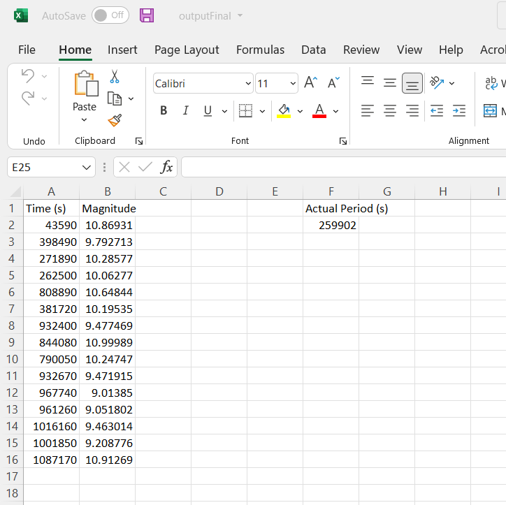

# Random Period Sine Curve Generator
This code generates a sine curve with a random period, and then generates 3 data sets with that period. Then all of the points from each data set except a few are removed. 

 

 <b> Full Sine Curve | Randomized Period </b> 
   
  
  
 This is an example of a randomly generated sine curve with no points taken away. 

 

 
 

 <b> Sample Sine Curve | Limited Data</b> 
   
   
   
  
  
 This is an example of a randomly generated sine curve with all of the points but a few taken away. 

 
 

 <b> Sample Excel SpreadSheet</b> 
   
   
   
  
  
 This is an sample of what the generated excel spreadsheet looks like. The "real" period is in the "F" column. 

 
